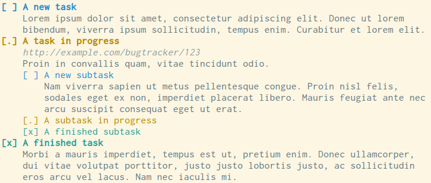
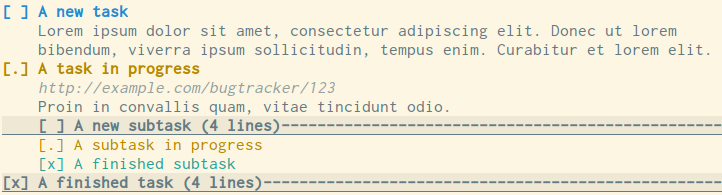

vim-todo
========

Syntax highlighting and folding support for simple todo lists.

Installation
------------

I recommend installing `vim-todo` using [pathogen][] or [Vundle][].

  [pathogen]: https://github.com/tpope/vim-pathogen
  [Vundle]: https://github.com/VundleVim/Vundle.vim

Then, add the following to your `.vimrc` to enable syntax highlighting and to
associate files with the `todo` filetype:

    # Enable syntax highlighting
    syntax enable
    # Associate files named TODO with the todo filetype
    au BufRead,BufNewFile TODO set filetype=todo
    # Associate files named *.todo with the todo filetype
    au BufRead,BufNewFile *.todo set filetype=todo
